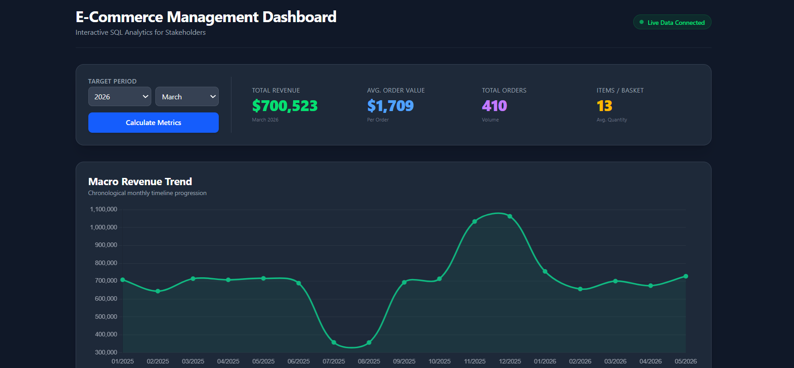
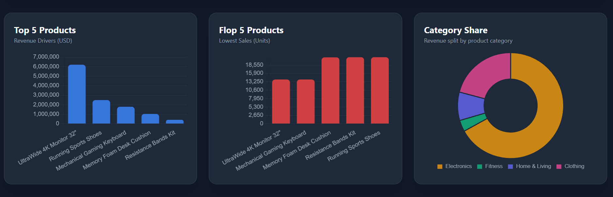

# E-Commerce Management Dashboard
### Interactive SQL Analytics for Stakeholders

A lightweight, fast, and responsive business intelligence tool built to bridge the gap between raw database storage and executive decision-making. This project demonstrates a complete data pipeline: from raw data aggregation in **PostgreSQL** via custom SQL queries, through a **FastAPI REST API**, to a dynamic dark-mode frontend visualized with **Chart.js** and **Tailwind CSS**.

---

## Project Goal
The main challenge I set for myself was to **connect a relational database directly to a live dashboard interface** without relying on third-party BI platforms (like Tableau or Power BI). 

Instead of just writing isolated SQL queries, I wanted to build the entire "bridge" myself, keeping the data processing logic where it belongs—optimized directly inside the database management system.

---

## Chosen Metrics and Charts
The metrics on this dashboard were strategically selected to give stakeholders an instant, comprehensive health check of their sales performance:

* **Total Revenue & Total Orders:** The immediate "pulse" of the business to track overall scale and growth.
* **Average Order Value (AOV) & Items per Basket:** Key indicators of customer behavior. They show whether customers are buying premium items or building larger baskets, which helps evaluate upselling strategies.
* **Macro Revenue Trend:** A chronological line progression that automatically handles data anomalies (such as filtering out incomplete current months) to show true historical trajectories.
* **Category Share (Doughnut Chart):** Displays the percentage contribution of each product category to total revenue, calculating proportions dynamically on the fly.

---

## Tech Stack

* **Database (PostgreSQL):** The heavy-lifter. All data aggregations, financial calculations, and time-series filtering are handled on the database level using optimized SQL queries (CTEs, joins, and window-like aggregations).
* **Backend (FastAPI / Python):** Acts as a high-performance REST API. It captures frontend requests, communicates instantly with PostgreSQL, and serves clean, structured JSON data.
* **Frontend (JavaScript / Tailwind CSS):** Pure *vibe-coding* 💻. Built an adaptive, modern dark-mode UI. Uses native JS `fetch()` to update metrics asynchronously without page reloads, and integrates **Chart.js** with the **ChartDataLabels** plugin to render clean percentage overlays on charts dynamically.

---

## Key Features

* **Live Data Connected:** Seamless data flow from database to UI.
* **Dynamic Time Filtering:** Select any target period (Year/Month) to instantly recalculate all high-level business metrics.
* **Smart Labeling:** The category chart automatically hides percentage labels for tiny segments (< 3%) to prevent UI overlapping, while keeping absolute values accessible via interactive tooltips.
* **Performance First:** Zero heavy dependencies on the frontend, ensuring sub-second rendering times.

